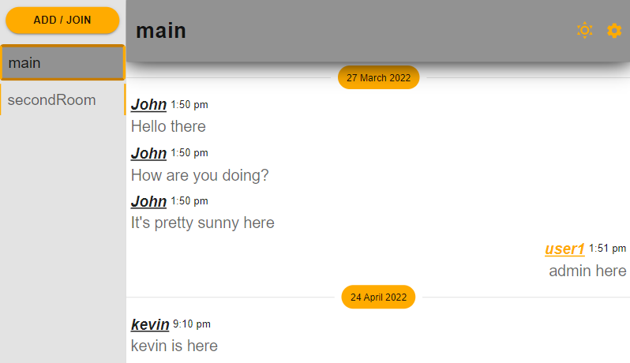

# Beeschats



Project to learn more about SocketIO, Express, React as well as to gain more experience developing full stack applications.\
~~App is hosted on netlify and can be found [here](https://beeschats.netlify.app/).~~

> Heroku has stopped their free dynos plan and the backend no longer has a place to call home until I fix it.
> The frontend is still hosted on netlify, just that the functionality does not work.

## Features

- Account Registration and Authentication of Users
- Realtime chatting
- Custom Rooms
- Light/Dark Mode

## Built With

- React
- SocketIO
- [MongoDB](https://www.mongodb.com/)
- [Material-UI](https://mui.com/)

## Run Locally

Clone the project

```
  git clone https://github.com/JamesCrr/Chat-WebApp.git
```

Since this repository contains both Server and Client, you will need to config **BOTH** in order to run this locally

### Start by configuring Local Server

Go to the server directory

```
  cd Chat-WebApp/server
```

Install dependencies

```
  npm install
```

Include the environment variables

```
PORT = YOUR_LOCALSERVER_PORTNUMBER
JWT_SECRET = YOUR_JSONWEBTOKEN_SECRET_KEY
JWT_LIFETIME = YOUR_JSONWEBTOKEN_LIFETIME
MONGOURL = YOUR_MONGODB_COLLECTION_URL
```

Start the server

```
  npm run nstart
```

### Config the Client

Go to the client directory

```
  cd Chat-WebApp/client
```

Install dependencies

```
  npm install
```

Include the environment variables

```
// YOUR_LOCALSERVER_PORTNUMBER = The earlier port number that you set in the environment variable of the Server
REACT_APP_SERVERURL = http://localhost:YOUR_LOCALSERVER_PORTNUMBER
```

Start the client

```
  npm start
```

## Demo Accounts

```
Username: User1
Email: user@mail.com
Password: q

Username: John
Email: qwe@mail.com
Password: qwe

Username: Kevin
Email: asd@mail.com
Password: e
```

## Deploying to Heroku

```
$ git add .
$ git commit -m "commit message"
$ git push heroku main
```

## License

[MIT](https://choosealicense.com/licenses/mit/)
